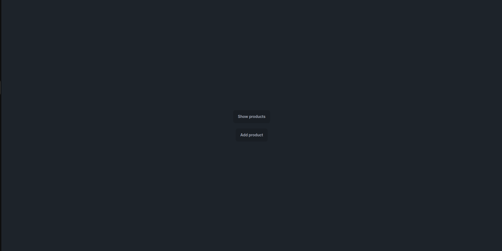

# How to start

## Step 1: start server

from root folder run the command:

```sh
cd PicoPublish_Backend
```
followed by 

```sh
dotnet run
```

## Step 2 start frontend
In a new terminal from root folder run the command:

```sh
cd PicoPublish_Frontend
```

followed by

```sh
npm run dev
```

The application should now be running on 'localhost:3000'. If not, you might have to restart the frontend.

